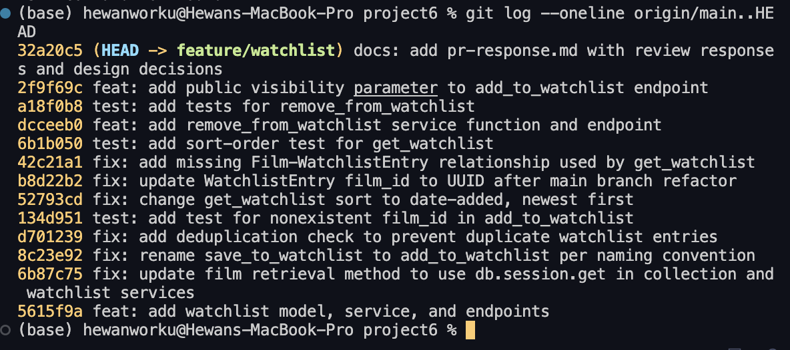

# PR Response Doc - CineLog Watchlist Feature

## AI Usage

I used an AI coding assistant at several points during this project:

- **Codebase orientation (Milestone 1):** I had it summarize `models.py`, `services/collection_service.py`, and `tests/test_collection.py` before reading the review comments, and checked its summaries against the actual code. One thing the orientation pass surfaced that I would have missed: `CollectionEntry` enforces deduplication twice, with a service-level check and a `UniqueConstraint` in the model. That shaped how I addressed Comment 2.
- **Drafting Comments 4 and 5:** I decided the positions myself (keep `public=True`, and side with the maintainer on date-added sort) and gave the AI the context that grounded them, including how I actually use watchlists: I save a lot and almost always watch recent adds, so alphabetical never matched my behavior. The AI helped structure the drafts and played devil's advocate. Its strongest pushback was "privacy by default" as the modern norm on Comment 4, which is why my final response leans on the comparison to the collection's existing visibility rather than a generic "discovery is good" claim. I reviewed and edited the final wording of both responses.
- **Commit-format check (Milestone 4):** I gave it my `git log --oneline` output before the final screenshot and asked whether every message was conventional and single-purpose. It flagged the original "added watchlist model and endpoint / fixed a bug / more changes" commit, which I reworded during the interactive rebase.

The positions in Comments 4 and 5 and the usage context behind them are mine. The AI assisted with implementation, drafting, adversarial review, and format verification.

---

## Comment 1 - Rename

> `save_to_watchlist()` should follow the project's naming convention. Compare with `add_to_collection()`. The pattern here is `verb_to_noun`. Please rename to `add_to_watchlist()` and update all call sites.

**What I did:**
Renamed `save_to_watchlist()` to `add_to_watchlist()` in `services/watchlist_service.py` and updated both references in `routes/watchlist/watchlist.py`: the import on line 8 and the call inside the `POST /watchlist/<user_id>/add` handler. I also updated the first line of the docstring from "Save a film" to "Add a film" so the prose matches the new name.

**How I verified:**
Before editing, I ran a project-wide search (`grep -rn "save_to_watchlist" --include="*.py" .`) to list every call site up front. It found exactly three: the definition in `services/watchlist_service.py:12`, plus the import and call in `routes/watchlist/watchlist.py` (lines 8 and 32). After the rename I re-ran the same search and got zero matches, then ran the full test suite (`pytest tests/ -v`), which passed. Since the route module imports the function by name, a missed call site would have failed at import time in the tests, so a green suite is meaningful verification here, not just "no syntax errors."

---

## Comment 2 - Deduplication

> What happens if a user calls this with a film that's already on their watchlist? The current implementation would add a duplicate entry. Please handle this case.

**What I did:**
Added a deduplication check to `add_to_watchlist()`. After confirming the film exists, it queries `WatchlistEntry.query.filter_by(user_id=user_id, film_id=film_id).first()`. If an entry already exists, it raises a new `AlreadyInWatchlistError` instead of inserting a duplicate, and the route translates that exception into a **409 Conflict** JSON response. I also added a `UniqueConstraint("user_id", "film_id")` to the `WatchlistEntry` model as a database-level backstop, and wrapped the route's service call in try/except so `FilmNotFoundError` returns a clean 404 rather than a 500 (matching how the collection route behaves).

**How I verified:**
I exercised the endpoint through Flask's test client: adding the same film twice returns 201 then 409 with an error message, and only one row exists afterward. The existing `test_add_to_collection_duplicate_raises` test also confirms the pattern I copied is the one the project already tests for.

**Reference to the existing pattern:**
This mirrors `add_to_collection()` in `services/collection_service.py` exactly. That function does a `filter_by(user_id, film_id).first()` existence check and raises `AlreadyInCollectionError`, and `CollectionEntry` carries a `unique_user_film_collection` constraint. I followed all three parts of that pattern: a dedicated exception class (defined in the watchlist service, since collection errors live in the collection service), the service-level check, and the model-level unique constraint (`unique_user_film_watchlist`). I also kept the collection route's convention of mapping the duplicate error to HTTP 409.

---

## Comment 3 - Missing test

> Please add a test for the case where `film_id` doesn't exist in the database. Look at the existing tests in `test_collection.py`. The pattern is there.

**What I did:**
Created `tests/test_watchlist.py` with `test_add_to_watchlist_nonexistent_film_raises`. It asserts that calling `add_to_watchlist()` with a `film_id` that isn't in the database raises `FilmNotFoundError` (rather than a database integrity error from the foreign key). The file reuses the same three fixtures as the collection tests: an isolated app with an in-memory SQLite database, a `sample_user`, and a `sample_film`. That keeps the two test files structurally identical.

**How I verified:**
`pytest tests/test_watchlist.py -v` passes, and the full suite (`pytest tests/ -v`) passes alongside the existing collection tests. After the rebase (Comment 6), I updated the fake ID from an integer to a UUID string (`"00000000-0000-0000-0000-000000000000"`), the same sentinel value `test_add_to_collection_nonexistent_film_raises` uses, and re-ran the suite.

**Which test I modeled it on:**
`test_add_to_collection_nonexistent_film_raises` in `tests/test_collection.py`: same fixture structure, same `pytest.raises(FilmNotFoundError)` assertion, same nonexistent-UUID sentinel. The test targets exactly the case the reviewer asked for, a `film_id` that doesn't exist, not some other edge case.

---

## Comment 4 - Default visibility

> I notice watchlists default to `public=True`. We don't have a documented decision on default visibility for user lists. Before I can approve this, I need you to add a note to your PR description explaining your reasoning.

**My position:**
Keep `public=True`, but stop treating it as an inherited default. This PR makes it a documented decision (here) and adds an escape hatch: `POST /watchlist/<user_id>/add` now accepts an optional `public` field, so anyone who wants a private entry can say so at the moment they add the film.

**Reasoning:**
The thing that convinced me was comparing the watchlist to the data CineLog already exposes. `CollectionEntry` records what someone actually watched and their 1-5 rating. That is viewing history plus opinions, and it doesn't have a `public` flag at all; collections are just visible. A watchlist entry is much less revealing than that: it's "I might want to see this someday," with no history and no rating attached. If we made the watchlist private by default, we'd have the strange situation where our most personal list is wide open and our least personal one is locked down. I'd rather keep the platform's visibility posture consistent and fix privacy across the board later if we decide to.

The other half is what public watchlists are for on a community film tracker. The reason to keep a watchlist on CineLog instead of in your Notes app is other people: seeing that a friend saved the same film, borrowing ideas from someone else's queue. That only works if watchlists are visible by default. And it matters most for brand-new users, who have no followers yet and whose first impression of the platform depends on there being visible activity from everyone else.

**Tradeoff acknowledged:**
Private-by-default buys something real: nobody ever gets surprised that a saved film is visible, and some saves genuinely can feel personal (subject matter, genre). "Privacy by default" is also what people increasingly expect from new apps, so I don't dismiss it. I still think public wins here because the exposure is bounded (one film title, no behavior, no ratings), the rest of CineLog already works this way, and the new `public` parameter gives cautious users a real choice up front instead of an all-or-nothing default. If users turn out to be uncomfortable, flipping the default is a one-line change, and this note is the record of what to revisit.

---

## Comment 5 - Sort order

> I'd prefer watchlists to default to "date added" order rather than alphabetical. Most users want to see what they added recently. I'm open to discussion if you see it differently, but let's make a decision and document it.

**My position:**
I agree: date-added, newest first. I changed `get_watchlist()` to sort by `date_added` descending and added a regression test (`test_get_watchlist_returns_newest_first`) so the decision is enforced, not just written down here.

**Reasoning:**
Honestly, this is how I use watchlists myself. On Netflix I save things constantly, and what I actually end up opening is almost always something I added in the last week or two: the trailer I saw last night, the thing a friend mentioned yesterday. The stuff I saved months ago is basically an archive I never scroll to. A watchlist is a queue of intent, and intent decays. Newest-first puts the films someone is most likely to actually act on at the top. Alphabetical is a lookup order; it only helps when you already know which film you're hunting for in a long list. That's the rare case, and it's better served by a search or filter parameter later than by making everyone's default view an A-to-Z index.

There's also a consistency argument straight from this codebase: `get_collection()` already returns newest-first, and there's a test (`test_get_collection_returns_newest_first`) locking that in. Users shouldn't need two mental models for CineLog's two lists. "Collection shows recent first, watchlist is alphabetized" is the kind of inconsistency that gets flagged eventually anyway. Small bonus: sorting on `WatchlistEntry.date_added` let me drop the `.join(Film)` that title-sorting required, so the query got simpler too.

**Engagement with reviewer's point:**
The maintainer said "most users want to see what they added recently." I'm agreeing with evidence rather than just deferring: my own usage matches it, and the project itself already voted for date-added in `get_collection()`; the watchlist was the outlier. Where I'd extend the point: if long watchlists make specific films hard to find, the fix is an opt-in `?sort=title` or search parameter, not changing the default back. Happy to file that as a follow-up issue.

---

## Comment 6 - Rebase

> A refactor merged to `main` that changed film IDs from integers to UUIDs. Your watchlist code still references integer IDs. Please rebase on `main` and update accordingly.

**What conflicted:**
The conflict was in `models.py`. On `main`, the refactor migrated `Film.id` from an auto-incrementing `Integer` to a `String(36)` UUID (and `CollectionEntry.film_id` with it). My branch's `WatchlistEntry` model still declared `film_id = db.Column(db.Integer, db.ForeignKey("film.id"))`, an integer foreign key pointing at a column that is now a UUID string. During `git rebase origin/main`, git could not reconcile the two versions of the `WatchlistEntry` region of `models.py` and stopped with a content conflict (`UU models.py`).

**How I resolved it:**
I kept `main`'s side for everything it refactored (the UUID `Film` and `CollectionEntry` definitions) and re-added the `WatchlistEntry` class from my branch, then continued the rebase. After the rebase completed, I made a dedicated commit (`fix: update WatchlistEntry film_id to UUID after main branch refactor`) that finished the semantic half of the conflict: changed `WatchlistEntry.film_id` from `db.Integer` to `db.String(36)`, updated the service docstring (`film_id (int)` to `film_id (str): UUID of the film`), updated the route docstring's example body from `<int>` to `"<uuid>"`, and changed the test's fake film ID from `999999` to the UUID sentinel string. Splitting it this way keeps the conflict resolution reviewable: the rebase commits show what merged, and one focused `fix:` commit shows every place integer IDs were purged.

**How I verified no conflict remains:**
- Searched for conflict markers (`<<<<<<<`, `>>>>>>>`) across the repo: none.
- Ran `grep -rn "Integer"` across `models.py`, `services/`, and `routes/`: the only remaining `Integer` columns are `year` and `rating`, which are genuinely integers.
- `git log --merges origin/main..HEAD` is empty and `git log --oneline` shows a linear history with no merge commits.
- Full test suite passes (8 tests), and I exercised every endpoint through Flask's test client with real UUID film IDs: add (201), duplicate add (409), nonexistent film (404), list (200, newest first), remove (200), re-remove (404).

---

## Stretch 1 - `remove_from_watchlist()`

**What I did:**
Implemented `remove_from_watchlist(user_id, film_id)` in `services/watchlist_service.py`, following `remove_from_collection()` line for line: it looks up the entry with `filter_by(user_id, film_id).first()`, raises a new `NotInWatchlistError` **if the film isn't on the watchlist** (rather than silently succeeding), and otherwise deletes the entry, commits, and returns `True`. The naming follows the project's `verb_from_noun` convention (`remove_from_collection` maps to `remove_from_watchlist`), and the exception mirrors `NotInCollectionError`. I also added a `DELETE /watchlist/<user_id>/remove` endpoint that maps `NotInWatchlistError` to a 404, exactly as the collection's remove route does.

**Tests:** Two tests in `tests/test_watchlist.py`: `test_remove_from_watchlist_missing_entry_raises` (removing a film that was never added raises `NotInWatchlistError`) and `test_remove_from_watchlist_deletes_entry` (a successful remove returns `True` and leaves zero matching rows).

## Stretch 2 - Second test (sort order)

**What I did:**
Added `test_get_watchlist_returns_newest_first`, modeled on `test_get_collection_returns_newest_first`: it inserts two entries with `date_added` five days apart and asserts the newer film comes back first.

**Why this edge case:**
Two reasons. First, it turns my Comment 5 decision into an enforced contract. Without it, someone could quietly revert the sort and no test would fail. Second, writing it caught a real bug in the original PR: `get_watchlist()` calls `entry.film.to_dict()`, but `WatchlistEntry` had no relationship to `Film` (the `Film` model only defined a `collection_entries` backref), so **`GET /watchlist/<user_id>` raised `AttributeError` for any non-empty watchlist**. The feature's read path had never actually worked. I fixed it by adding `watchlist_entries = db.relationship("WatchlistEntry", backref="film", lazy=True)` to `Film`, matching the existing `collection_entries` pattern, in its own commit (`fix: add missing Film-WatchlistEntry relationship used by get_watchlist`). This is exactly why the review asked for tests: the only existing coverage was on the collection side.

## Stretch 3 - Visibility toggle

**What I did:**
Added an optional `public` parameter to `add_to_watchlist(user_id, film_id, public=True)` and exposed it in the endpoint: `POST /watchlist/<user_id>/add` now accepts `{ "film_id": "<uuid>", "public": false }`. The default remains `True` (per the Comment 4 decision), so existing callers are unaffected. A caller who wants a private entry passes `"public": false` and the entry is created with `public=False`, which round-trips through `to_dict()` and `GET /watchlist/<user_id>`. Verified through the test client: an add with `"public": false` returns 201 with `"public": false` in the response body.

---

## Screenshot - `git log --oneline`



(The `docs:` commit adding this response document lands immediately after the screenshot was taken, on top of the commits shown.)

---

## PR Description

*(Also posted on the GitHub PR.)*

### What this PR does

Adds a **watchlist** to CineLog: a per-user list of films they want to watch (distinct from the collection, which tracks films already watched). It introduces the `WatchlistEntry` model and three REST endpoints:

- `POST /watchlist/<user_id>/add` adds a film (`{ "film_id": "<uuid>", "public": false }`, `public` optional). Returns 201, or 404 if the film doesn't exist, or 409 if it's already on the watchlist.
- `GET /watchlist/<user_id>` lists the user's watchlist, newest first, each film annotated with `date_added` and `public`.
- `DELETE /watchlist/<user_id>/remove` removes a film (`{ "film_id": "<uuid>" }`). Returns 200, or 404 if it wasn't on the list.

### Design decisions (from review)

- **Default visibility: `public=True`.** Watchlist entries are low-sensitivity intent signals (unlike the collection, which holds viewing history and ratings yet has no privacy flag), and public lists feed CineLog's community discovery loop. Callers can opt out per entry with the new explicit `public` parameter.
- **Sort order: date added, newest first.** A watchlist is a queue of intent where recent additions are the most actionable, and this matches `get_collection()`'s existing newest-first behavior, so both lists share one mental model. Enforced by a regression test.

### How to test manually

1. `python -m venv .venv && source .venv/bin/activate && pip install -r requirements.txt`
2. Seed a user and two films (the films API is read-only), then start the app:
   ```bash
   python -c "
   from app import create_app, db
   from models import User, Film
   app = create_app()
   with app.app_context():
       db.create_all()
       u = User(username='demo', email='demo@example.com')
       f1 = Film(title='Alien', year=1979, genre='Horror')
       f2 = Film(title='Paddington 2', year=2017, genre='Comedy')
       db.session.add_all([u, f1, f2]); db.session.commit()
       print('USER_ID=' + u.id); print('FILM1=' + f1.id); print('FILM2=' + f2.id)
   "
   python app.py
   ```
3. Using the printed IDs (shell vars below for readability):
   ```bash
   # Add a film -> expect 201 with the entry JSON, "public": true
   curl -s -X POST http://127.0.0.1:5000/watchlist/$USER_ID/add \
     -H "Content-Type: application/json" -d "{\"film_id\": \"$FILM1\"}"

   # Add the same film again -> expect 409 "already on this user's watchlist"
   curl -s -X POST http://127.0.0.1:5000/watchlist/$USER_ID/add \
     -H "Content-Type: application/json" -d "{\"film_id\": \"$FILM1\"}"

   # Add a second film privately -> expect 201 with "public": false
   curl -s -X POST http://127.0.0.1:5000/watchlist/$USER_ID/add \
     -H "Content-Type: application/json" -d "{\"film_id\": \"$FILM2\", \"public\": false}"

   # Add a nonexistent film -> expect 404
   curl -s -X POST http://127.0.0.1:5000/watchlist/$USER_ID/add \
     -H "Content-Type: application/json" -d '{"film_id": "00000000-0000-0000-0000-000000000000"}'

   # List the watchlist -> expect 200, Paddington 2 first (added most recently)
   curl -s http://127.0.0.1:5000/watchlist/$USER_ID

   # Remove a film -> expect 200; repeat the same call -> expect 404
   curl -s -X DELETE http://127.0.0.1:5000/watchlist/$USER_ID/remove \
     -H "Content-Type: application/json" -d "{\"film_id\": \"$FILM1\"}"
   ```
4. Run the automated suite: `pytest tests/ -v` shows 8 tests, all passing.
